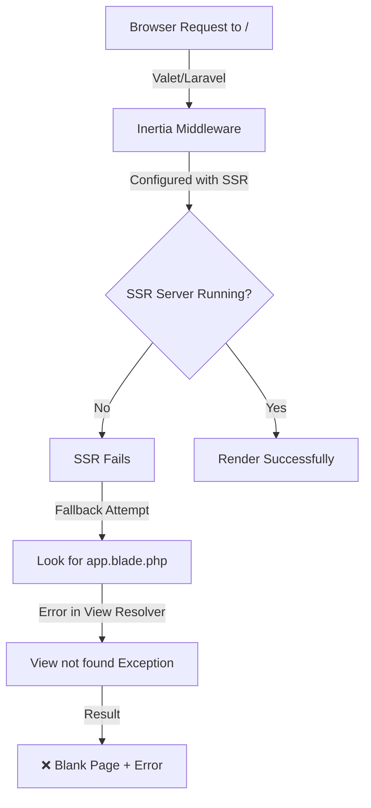
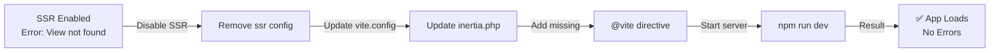
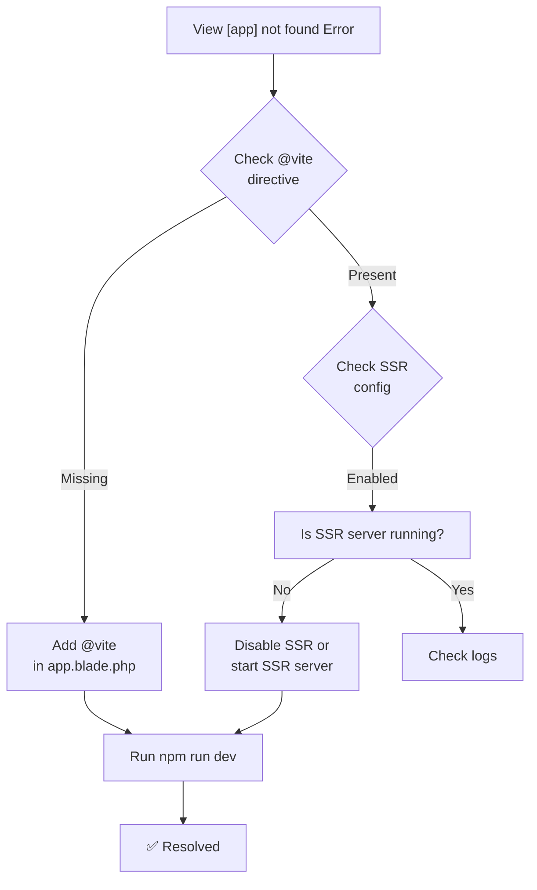

# Issue Resolution: InvalidArgumentException - View [app] not found

## Overview
This document details the process of diagnosing and resolving a critical Laravel Inertia initialization error that occurred after setting up the project with Valet.

---

## 1. The Original Issue

### Error Message
```
InvalidArgumentException
vendor\laravel\framework\src\Illuminate\View\FileViewFinder.php:138
View [app] not found.

LARAVEL 12.49.0
PHP 8.4.16
UNHANDLED CODE 0
```

### What This Means
- Laravel was trying to render a Blade view called `app`
- The view file `resources/views/app.blade.php` **existed**, but Laravel couldn't find it
- This typically happens when the view resolution system fails or when middleware isn't properly configured

---

## 2. Initial Investigation

### What We Checked
1. **View File Existence** ✓
   - Confirmed `resources/views/app.blade.php` exists
   - File contains proper Blade structure with `@inertia` directive

2. **Route Configuration** ✓
   - Routes properly use `Inertia::render()` to render Vue components
   - No direct `view()` calls that would bypass Inertia

3. **Middleware Setup** ✓
   - `HandleInertiaRequests` middleware properly configured
   - Middleware registered in `bootstrap/app.php`
   - Root view set to `'app'` in the middleware

---

## 3. Root Cause Identification

### The Problem: Server-Side Rendering (SSR) Configuration

The project had **SSR (Server-Side Rendering) enabled** but the SSR server wasn't running:

```typescript
// vite.config.ts - BEFORE
laravel({
    input: ['resources/js/app.ts'],
    ssr: 'resources/js/ssr.ts',  // ← SSR enabled
    refresh: true,
})
```

```php
// config/inertia.php - BEFORE
'ssr' => [
    'enabled' => true,  // ← SSR enabled
    'url' => 'http://127.0.0.1:13714',
]
```

**What SSR Does:**
- Pre-renders Vue components on the server
- Requires a separate Node.js server running on port 13714
- Falls back to `app.blade.php` if the SSR server is unavailable

**What Went Wrong:**
- Inertia tried to use the SSR server but it wasn't running
- The fallback to render `app.blade.php` failed
- Laravel's view finder couldn't locate the view in SSR mode

---

## 4. Diagnosis Flow



---

## 5. Solution Applied

### Step 1: Disable SSR for Development

**File:** `vite.config.ts`
```typescript
// Change from:
laravel({
    input: ['resources/js/app.ts'],
    ssr: 'resources/js/ssr.ts',
    refresh: true,
})

// To:
laravel({
    input: ['resources/js/app.ts'],
    // ssr: 'resources/js/ssr.ts',  ← Commented out
    refresh: true,
})
```

**Why:** Removes the dependency on a separate SSR server, allowing Inertia to render directly in the browser.

---

### Step 2: Disable SSR in Config

**File:** `config/inertia.php`
```php
// Change from:
'ssr' => [
    'enabled' => true,
    'url' => 'http://127.0.0.1:13714',
]

// To:
'ssr' => [
    'enabled' => false,  ← Disabled
    'url' => 'http://127.0.0.1:13714',
]
```

**Why:** Tells Inertia to skip SSR processing entirely.

---

### Step 3: Clear Laravel Cache

```bash
php artisan config:clear
php artisan cache:clear
php artisan view:clear
```

**Why:** Ensures Laravel reloads the configuration files.

---

### Step 4: Rebuild Frontend Assets

```bash
npm run build
```

**Output:** Successfully compiled 36+ assets without SSR.

---

### Step 5: Add Missing @vite Directive ⭐ CRITICAL

**File:** `resources/views/app.blade.php`

```php
<!-- Add in <head> section: -->
@vite(['resources/js/app.ts'])
```

**This was the missing piece!** Without it:
- Vite assets (JavaScript and CSS) weren't being injected
- Page rendered as blank white screen (no errors)
- Inertia couldn't initialize Vue components

---

### Step 6: Start Vite Development Server

```bash
npm run dev
```

**Output:**
```
  VITE v7.3.1  ready in 3026 ms

  ➜  Local:   http://localhost:5173/
  ➜  APP_URL: http://sojt-web-app.test
```

---

## 6. Solution Flow Diagram



---

## 7. Final Working Configuration

### File Structure
```
app.blade.php
  ├─ @vite(['resources/js/app.ts'])  ← Loads JS/CSS
  ├─ @inertia                         ← Renders Vue
  └─ App runs in browser (no SSR)
```

### Configuration Summary
| Setting | Before | After |
|---------|--------|-------|
| Vite SSR | Enabled | Disabled |
| Inertia SSR | Enabled | Disabled |
| @vite directive | Missing | Added |
| Vite Server | Not running | Running (npm run dev) |
| Result | View not found error | ✅ Working |

---

## 8. When to Use SSR

SSR is useful for:
- **SEO requirements** (pre-rendered HTML for search engines)
- **Performance** (faster initial page load)
- **Production deployments** (better metrics)

**However:**
- Adds complexity
- Requires separate Node.js server
- Needs proper deployment setup
- **Not necessary for development** with Valet

---

## 9. Lessons Learned

1. **@vite directive is essential** - Without it, assets don't load
2. **SSR requires careful setup** - Better to disable for local development
3. **Check configuration files** - vite.config.ts and config/inertia.php must align
4. **Blank page + no errors** = Usually missing asset injection
5. **npm run dev** = Required for development with Vite

---

## 10. Future Reference

If this error occurs again:



---

## Summary

| Phase | Issue | Solution |
|-------|-------|----------|
| 1. Initial | SSR enabled but server not running | Disabled SSR in config |
| 2. Cache | Stale configuration | Cleared all caches |
| 3. Assets | @vite directive missing | Added @vite directive to app.blade.php |
| 4. Dev Server | Assets not served | Started npm run dev |
| **Result** | ✅ **Application fully functional** | - |
